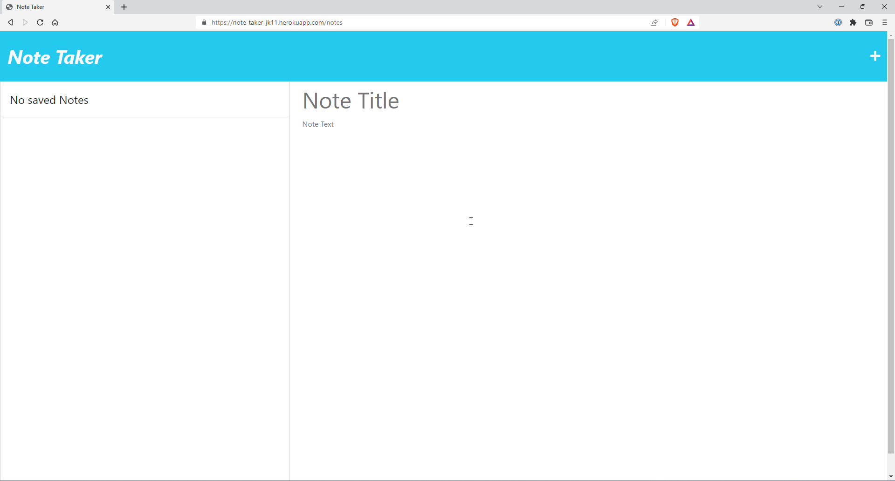

# note-taker-jk11
# Note Taker
# 
 
 

## Description
In this project, is an application called "Note Taker" that can be used to write, save and delete notes.  It is deployed using Heroku or localhost.

## Table of Contents

  * [User Story](#userstory)
  * [Acceptance Criteria](#acceptance)
  * [Installation](#installation)
  * [Usage](#usage)
  * [Tests](#tests)
  * [Links](#links)
  * [Mockup](#mockup)
  * [License](#license)

## User Story
  
AS A small business owner 
I WANT to be able to write and save notes 
SO THAT I can organize my thoughts and keep track of tasks I need to complete 

## Acceptance Criteria
  
GIVEN a note-taking application 
WHEN I open the Note Taker 
THEN I am presented with a landing page with a link to a notes page 
WHEN I click on the link to the notes page 
THEN I am presented with a page with existing notes listed in the left-hand column, plus empty fields to enter a new note title and the note’s text in the right-hand column 
WHEN I enter a new note title and the note’s text 
THEN a Save icon appears in the navigation at the top of the page 
WHEN I click on the Save icon 
THEN the new note I have entered is saved and appears in the left-hand column with the other existing notes 
WHEN I click on an existing note in the list in the left-hand column 
THEN that note appears in the right-hand column 
WHEN I click on the Write icon in the navigation at the top of the page 
THEN I am presented with empty fields to enter a new note title and the note’s text in the right-hand column 

## Installation 
  
    1) Deploy application from [Heroku](https://note-taker-jk11.herokuapp.com/).  

If user wants to run application locally 
    2) Then copy and clone the repo [GitHub](https://github.com/jckutch/note-taker-jk11).  
    3) Then install all dependencies with `npm i`.  
    4) Then run `node server.js` from terminal and open the local host in a browser to deploy the application. 

## Usage
  
User can create, save and delete notes as needed.

## Tests
  
No test

## Links
  
Heroku Link: https://note-taker-jk11.herokuapp.com/ 
Repository Link:  https://github.com/jckutch/note-taker-jk11

## Mockup
  

Sample HTML images: 
Landing Page: 
 
Blank Notes Page: 
 
Page with added notes:
 

## License 
   License
Licensed under   .
